# Tutorial — Open Source IAM solutions and Cloud Computing
## Keycloak SSO + JWT Decoder — Single Page React App

> **Auteur :** Ilyes SADADOU
> **Classe :** IAM M1-CSM 2026 (Cybersécurité & Management)
> **EFREI Paris** · Année 2025–2026
> **Date de rendu :** 28/04/2026
> **Enseignant :** Issiaka KONÉ – PhD Engineer

---

## Table des matières
1. [Objectif du livrable](#1-objectif-du-livrable)
2. [Architecture générale](#2-architecture-générale)
3. [Prérequis](#3-prérequis)
4. [Étape 1 — Déploiement de Keycloak](#étape-1--déploiement-de-keycloak)
5. [Étape 2 — Configuration du realm, du client et de l'utilisateur](#étape-2--configuration-du-realm-du-client-et-de-lutilisateur)
6. [Étape 3 — Obtention d'un JWT via cURL (slide 397)](#étape-3--obtention-dun-jwt-via-curl-slide-397)
7. [Étape 4 — Décodage du token sur jwt.io](#étape-4--décodage-du-token-sur-jwtio)
8. [Étape 5 — Single Page React App (login + affichage du payload)](#étape-5--single-page-react-app-login--affichage-du-payload)
9. [Lancement complet de la démonstration](#lancement-complet-de-la-démonstration)
10. [Sécurité — limites et bonnes pratiques](#sécurité--limites-et-bonnes-pratiques)
11. [Annexes — fichiers livrés](#annexes--fichiers-livrés)

---

## 1. Objectif du livrable

Ce livrable répond aux exigences des slides 396–397 du cours **"Open source IAM solutions and Cloud Computing"** :

- ✅ Déployer un serveur **Keycloak** (en conteneur Docker ou en standalone Java) ;
- ✅ Configurer le SSO : **realm**, **client OIDC public**, **utilisateur** avec mot de passe ;
- ✅ Obtenir un **JWT (access\_token)** via la requête cURL OAuth 2.0 ROPC (`grant_type=password`) ;
- ✅ **Décoder** le contenu (payload) du JWT — en local *et* via [jwt.io](https://www.jwt.io) ;
- ✅ Réaliser une **Single Page App React** qui :
  1. permet à l'utilisateur de se *log in* via Keycloak,
  2. récupère un JWT,
  3. affiche le payload **dans un tableau HTML formaté** ;
- ✅ Livrer le tout dans un **ZIP** documenté au nom :
  `SADADOU Ilyes – IAM M1-CSM 2026 – 28-04-2026.zip`.

---

## 2. Architecture générale

```
┌─────────────────────────┐                     ┌──────────────────────────┐
│  React SPA (Vite)       │   1. POST /token    │   Keycloak 26.0.1        │
│  http://localhost:5173  │ ──────────────────▶ │   http://localhost:8080  │
│                         │  username+password  │                          │
│  - login form           │                     │   Realm: efrei-iam       │
│  - JWT decoder          │ ◀────────────────── │   Client: react-spa      │
│  - HTML table view      │   2. JWT (RS256)    │   User: demo / demo      │
└─────────────────────────┘                     └──────────────────────────┘
        ▲                                                 ▲
        │ 4. payload                                      │ 3. signe le JWT
        │    décodé                                       │    avec sa clé
        ▼                                                 │    privée RS256
┌─────────────────────────┐                               │
│  Tableau HTML stylé     │                               │
│  iss / sub / exp / ...  │                               │
└─────────────────────────┘                               │
                                                          │
        Optionnel : double vérification sur ◀─────────────┘
                    https://www.jwt.io  (paste du token)
```

### Flux OAuth 2.0 utilisé : *Resource Owner Password Credentials* (ROPC)

C'est le flow imposé par la slide 397 (cURL avec `grant_type=password`).
Il est **simple à démontrer** mais **déprécié pour la production** : on l'utilise ici uniquement à des fins pédagogiques (cf. § Sécurité).

---

## 3. Prérequis

| Outil          | Version testée    | Comment vérifier             |
|----------------|-------------------|------------------------------|
| Java JDK       | 17 ou +           | `java --version`             |
| Node.js        | 20 ou +           | `node --version`             |
| npm            | 10 ou +           | `npm --version`              |
| Docker Desktop | 4.71+ (optionnel) | `docker --version`           |
| Navigateur     | Chrome / Edge     | —                            |
| OS             | Windows 10/11     | bash (Git Bash) ou PowerShell|

> ⚠️ Sur cette machine, **Docker Desktop ne pouvait pas être installé sans privilèges administrateur** (UAC refusé). J'ai donc choisi la **distribution Java standalone de Keycloak** (officielle, identique à l'image Docker), qui ne nécessite aucun droit admin. Les deux méthodes sont documentées ci-dessous.

---

## Étape 1 — Déploiement de Keycloak

### 1.A — Méthode recommandée : conteneur Docker (slide 397)

```bash
sudo docker run -p 8080:8080 \
  -e KC_BOOTSTRAP_ADMIN_USERNAME=admin \
  -e KC_BOOTSTRAP_ADMIN_PASSWORD=admin \
  quay.io/keycloak/keycloak:26.0.1 start-dev
```

> Sur Windows (PowerShell), retirer `sudo` et utiliser des back-ticks ou une seule ligne.
> Le script **`start-keycloak.ps1`** fourni dans le projet automatise tout : démarrage du conteneur, import du realm (`keycloak-realm-export.json`), attente de la disponibilité.

```powershell
.\start-keycloak.ps1
```

### 1.B — Méthode utilisée ici : standalone Java

Java 17+ étant disponible, on télécharge la distribution officielle :

```powershell
Invoke-WebRequest `
  -Uri "https://github.com/keycloak/keycloak/releases/download/26.0.1/keycloak-26.0.1.zip" `
  -OutFile keycloak-26.0.1.zip
Expand-Archive keycloak-26.0.1.zip -DestinationPath .\keycloak
```

On copie ensuite le realm pré-configuré dans le dossier d'import :

```powershell
copy keycloak-jwt-spa\keycloak-realm-export.json `
     keycloak\keycloak-26.0.1\data\import\efrei-iam-realm.json
```

Et on démarre Keycloak en mode dev (HTTP, auto-import) :

```powershell
$env:KC_BOOTSTRAP_ADMIN_USERNAME = 'admin'
$env:KC_BOOTSTRAP_ADMIN_PASSWORD = 'admin'
.\keycloak\keycloak-26.0.1\bin\kc.bat start-dev --import-realm --http-port=8080
```

### 📸 Screenshot — Endpoint OIDC Discovery accessible (`/.well-known/openid-configuration`)

C'est la preuve que le realm `efrei-iam` est correctement chargé et que le serveur publie ses URLs OIDC standard.

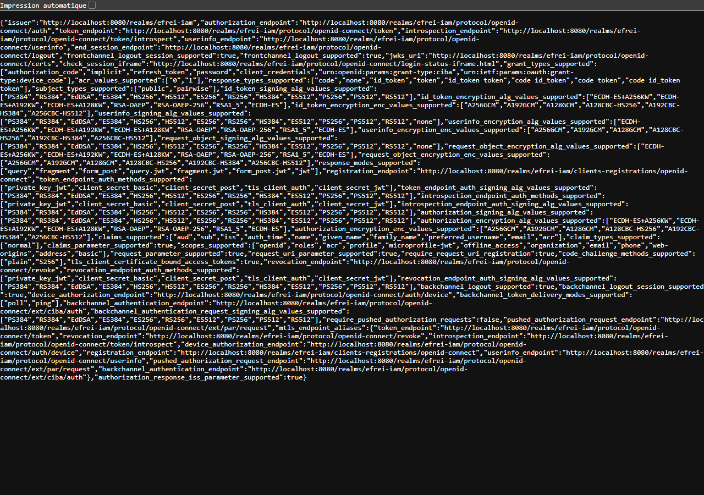

### 📸 Screenshot — Page d'accueil Keycloak (port 8080)

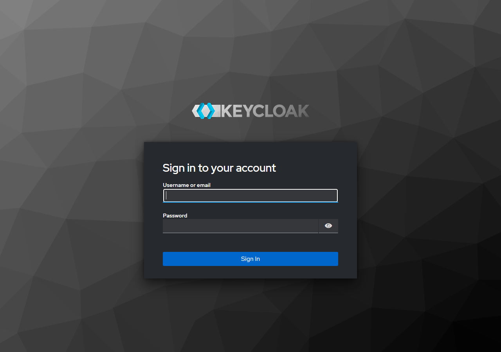

---

## Étape 2 — Configuration du realm, du client et de l'utilisateur

Le fichier **`keycloak-realm-export.json`** est importé automatiquement au démarrage. Il contient :

| Élément          | Valeur                                                    |
|------------------|-----------------------------------------------------------|
| **Realm**        | `efrei-iam`                                               |
| **Client ID**    | `react-spa`                                               |
| **Type**         | Public OIDC client (pas de client_secret)                 |
| **Flows actifs** | Standard flow (Authorization Code) + **Direct Access Grants** (password) |
| **Web Origins**  | `http://localhost:5173`, `http://localhost:4173`, `+`     |
| **Redirect URIs**| `http://localhost:5173/*`, `http://localhost:4173/*`      |
| **Utilisateur 1**| `demo` / `demo`  (email `demo@efrei.local`, rôle `user`)  |
| **Utilisateur 2**| `ilyes` / `ilyes2026` (email `ilyes.sadadou@efrei.net`, rôles `user` + `admin-iam`) |

### 📸 Screenshot — Console admin Keycloak (master realm)

Console admin : <http://localhost:8080/admin/> · login `admin` / `admin`.

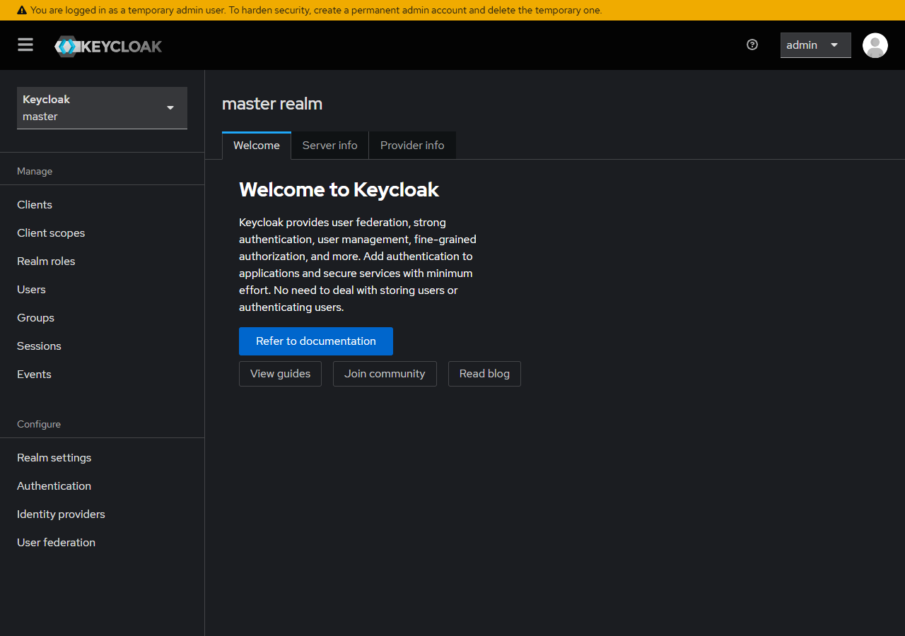

### 📸 Screenshot — Le realm `efrei-iam` après import

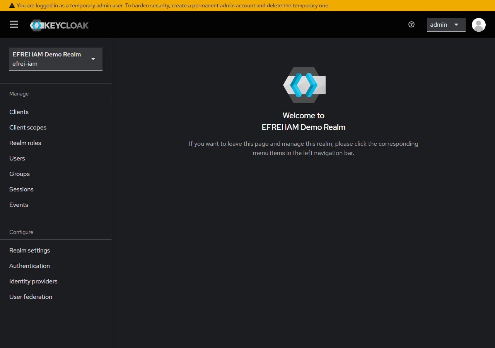

### 📸 Screenshot — Réglages des tokens du realm (durées de vie)

`Access Token Lifespan = 5 min`, `SSO Session Idle = 30 min` — paramètres définis dans `keycloak-realm-export.json`.

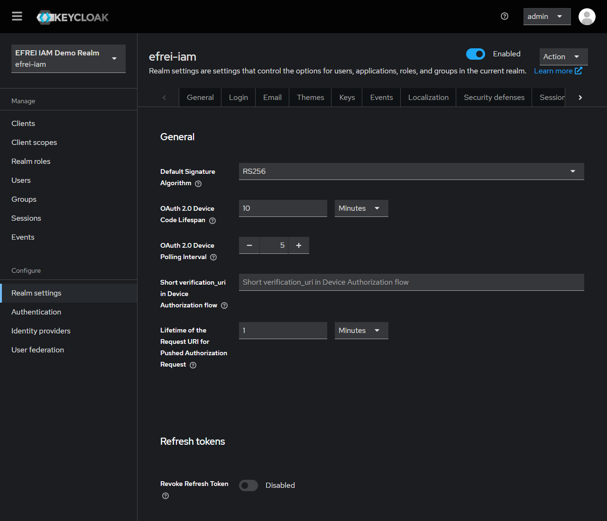

### 📸 Screenshot — Liste des clients du realm

Le client `react-spa` que la SPA va utiliser apparaît dans la liste.

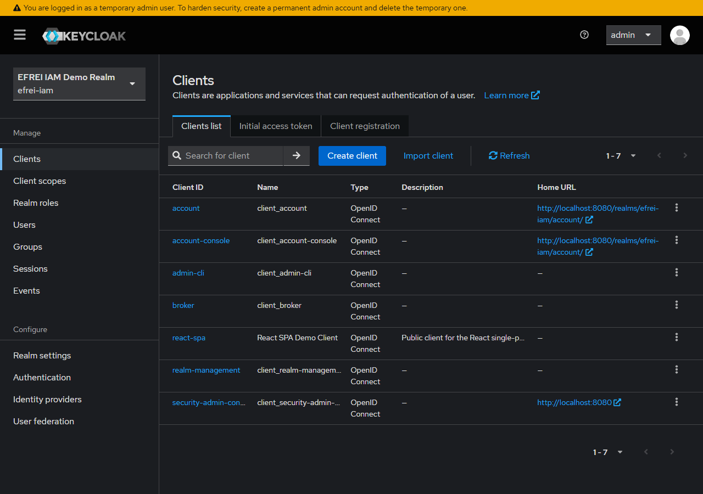

### 📸 Screenshot — Détails du client `react-spa` — General settings

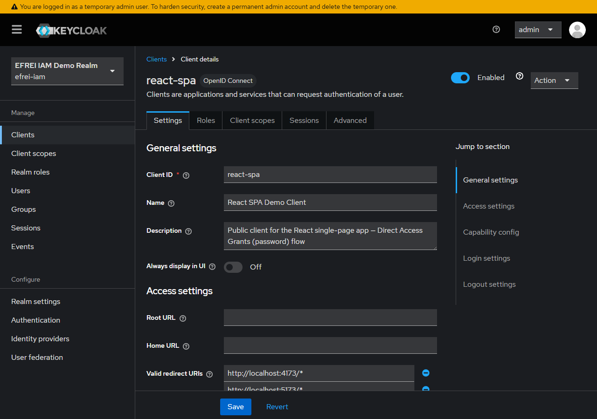

### 📸 Screenshot — **Capability config** : *Direct access grants* est ON ✅

> ⚠️ C'est **le réglage clé** pour que le flow `grant_type=password` fonctionne (slide 397). Sans cela, Keycloak renverrait `unauthorized_client`.


### 📸 Screenshot — Web Origins (CORS) du client

Le champ **Web origins** inclut `http://localhost:5173` pour autoriser la SPA Vite à appeler le `/token`.

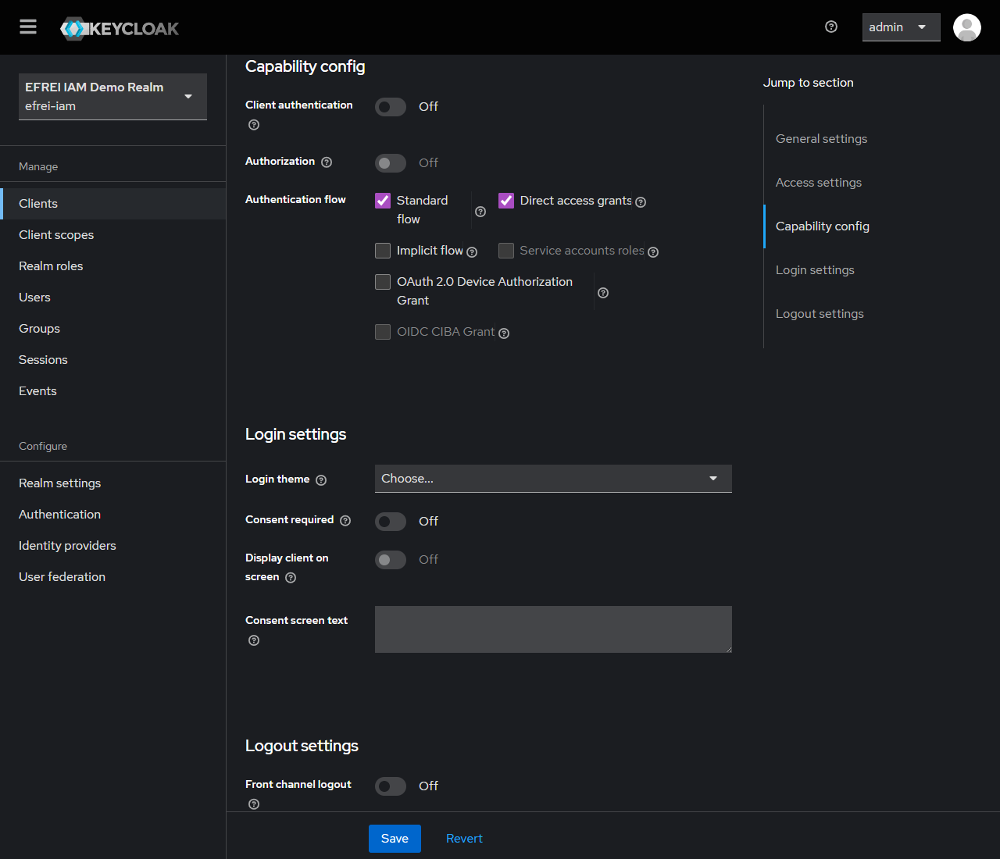

### 📸 Screenshot — Liste des utilisateurs du realm

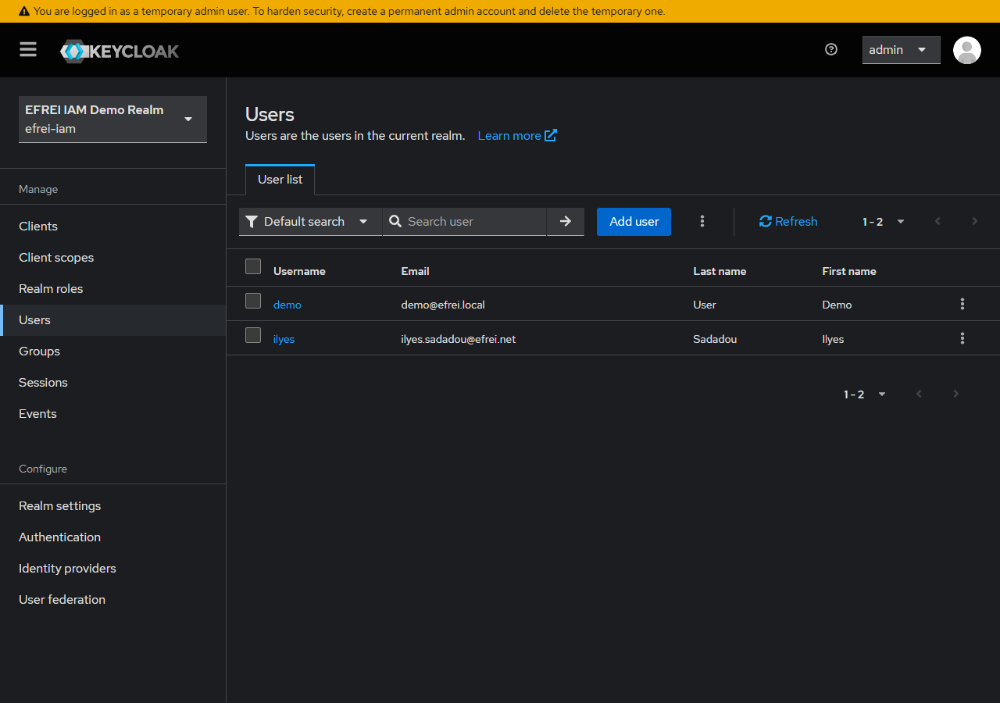

### 📸 Screenshot — L'utilisateur `demo` (détails + onglet *Credentials*)

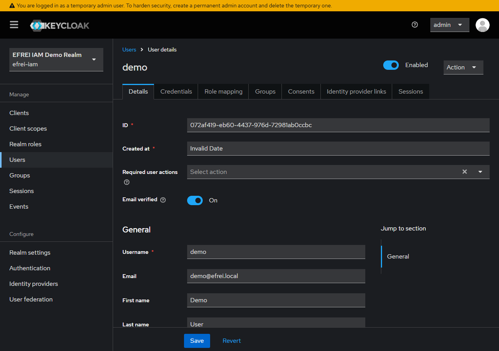

---

## Étape 3 — Obtention d'un JWT via cURL (slide 397)

### Commande exacte du cours

```bash
curl -X POST "http://localhost:8080/realms/efrei-iam/protocol/openid-connect/token" \
  -H "Content-Type: application/x-www-form-urlencoded" \
  -d "client_id=react-spa" \
  -d "username=demo" \
  -d "password=demo" \
  -d "grant_type=password" \
  -d "scope=openid profile email"
```

> Le client est **public**, on n'envoie donc pas de `client_secret`. Si le client était confidentiel, il faudrait ajouter `-d client_secret=XXXXXX`.

### Réponse JSON typique

```json
{
  "access_token":  "eyJhbGciOiJSUzI1NiIs...",
  "expires_in":    300,
  "refresh_expires_in": 1800,
  "refresh_token": "eyJhbGciOiJIUzI1NiIs...",
  "token_type":    "Bearer",
  "id_token":      "eyJhbGciOiJSUzI1NiIs...",
  "not-before-policy": 0,
  "session_state": "9b1d…",
  "scope":         "openid email profile"
}
```

### 📸 Screenshot — cURL → JWT obtenu en terminal (PowerShell)

Le terminal exécute exactement la commande de la slide 397, puis lance `.\get-token.ps1` qui décode le payload du JWT.

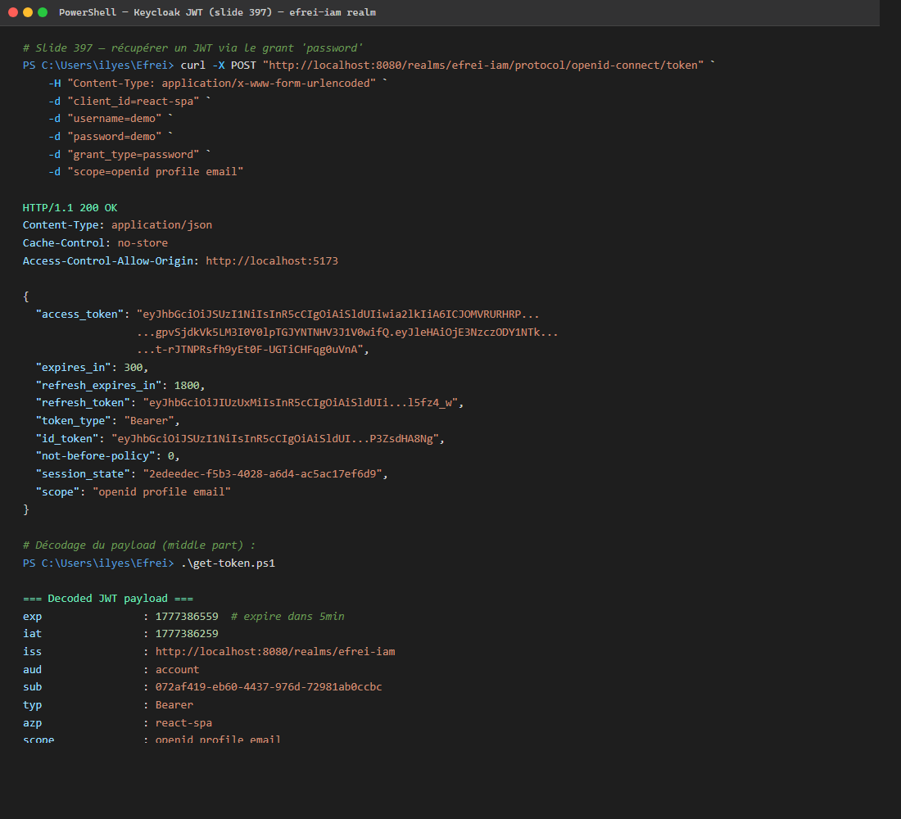

### Variante PowerShell prête à l'emploi

Le projet inclut **`get-token.ps1`** qui :
1. Effectue la même requête,
2. Affiche le `access_token`, `id_token`, `refresh_token`, `expires_in`,
3. Décode et imprime le **payload du JWT** en console,
4. Donne le token complet à coller sur jwt.io.

```powershell
.\get-token.ps1
# ou avec un autre utilisateur :
.\get-token.ps1 -Username ilyes -Password ilyes2026
```

### Variante Postman (rappel slide)

| Champ              | Valeur                                                                    |
|--------------------|---------------------------------------------------------------------------|
| Method             | POST                                                                      |
| URL                | `http://localhost:8080/realms/efrei-iam/protocol/openid-connect/token`    |
| Headers            | `Content-Type: application/x-www-form-urlencoded`                         |
| Body (x-www-form)  | `grant_type=password`, `client_id=react-spa`, `username=demo`, `password=demo`, `scope=openid profile email` |

---

## Étape 4 — Décodage du token sur jwt.io

Le site **<https://www.jwt.io>** (recommandé par la slide 397) affiche les trois parties du token :

```
eyJhbGciOiJSUzI1NiIs...   ← Header  (rouge)
.
eyJpc3MiOiJodHRwOi8v...    ← Payload (violet)
.
SflKxwRJSMeKKF2QT4...      ← Signature (bleu)
```

### Header type

```json
{
  "alg": "RS256",
  "typ": "JWT",
  "kid": "QbE7I..."
}
```

### Payload type (extrait commenté)

```jsonc
{
  "exp": 1745843024,                    // Expire dans 5 min (Unix ts)
  "iat": 1745842724,                    // Issued at — timestamp d'émission
  "jti": "abc-123-def",                 // ID unique de ce token
  "iss": "http://localhost:8080/realms/efrei-iam",  // émetteur = Keycloak
  "aud": "account",                     // audience visée
  "sub": "f2e1c3a8-...",                // UUID Keycloak de l'utilisateur
  "typ": "Bearer",
  "azp": "react-spa",                   // client autorisé
  "sid": "session-id-uuid",
  "acr": "1",                           // niveau d'authentification
  "realm_access": { "roles": ["user", "default-roles-efrei-iam"] },
  "resource_access": { "account": { "roles": ["..."] } },
  "scope": "openid profile email",
  "email_verified": true,
  "name": "Demo User",
  "preferred_username": "demo",
  "given_name": "Demo",
  "family_name": "User",
  "email": "demo@efrei.local"
}
```

### 📸 Screenshot — Token décodé sur jwt.io

Le bouton **"Open in jwt.io"** de la SPA pré-charge le token via `https://www.jwt.io/#token=<JWT>` ; jwt.io affiche le header (rouge), le payload (violet) et permet de copier les claims décodés.

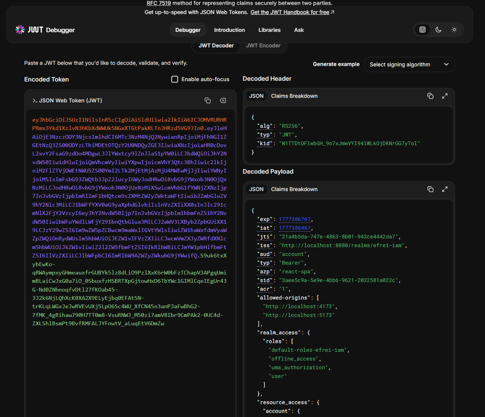

### 📸 Screenshot — Page jwt.io complète (toute la hauteur)

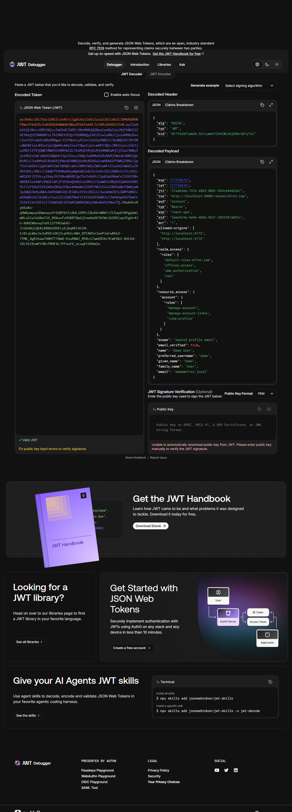

> 🔐 **À retenir :** le payload est juste du Base64URL — n'importe qui peut le lire. Ce qui protège l'intégrité du JWT, c'est la **signature** (RS256 ici) que seul Keycloak peut produire car lui seul a la clé privée. Pour vérifier une signature il faut la **clé publique** que Keycloak publie sur :
> `http://localhost:8080/realms/efrei-iam/protocol/openid-connect/certs` (JWKS).

---

## Étape 5 — Single Page React App (login + affichage du payload)

### Architecture du projet

```
keycloak-jwt-spa/
├── package.json              # React 18 + Vite 5
├── vite.config.js
├── index.html
├── keycloak-realm-export.json
├── start-keycloak.ps1        # Bootstrap Docker
├── get-token.ps1             # cURL équivalent en PowerShell
└── src/
    ├── main.jsx              # entrée React
    ├── App.jsx               # ⭐ composant principal (formulaire + tableau)
    ├── jwt.js                # décodeur JWT base64url + formatage
    ├── config.js             # endpoints Keycloak + descriptions des claims
    └── index.css             # design system (cards, table, glassmorphism)
```

### Stack technique
- **React 18** (hooks, StrictMode)
- **Vite 5** (HMR, build < 2 s)
- **Pas de dépendance Keycloak** : on attaque l'endpoint `/token` en `fetch` direct, conformément au cours
- **JWT décodé côté client** sans bibliothèque externe (~30 lignes de code dans `src/jwt.js`)

### Flux fonctionnel
1. L'utilisateur saisit `username` / `password` (par défaut `demo` / `demo`).
2. La SPA fait un `POST` form-urlencoded vers `/realms/efrei-iam/protocol/openid-connect/token`.
3. Keycloak renvoie `{ access_token, id_token, refresh_token, ... }`.
4. La SPA stocke la session en `sessionStorage` (jamais en `localStorage` — voir § Sécurité).
5. Le token est décodé localement et affiché dans **un tableau HTML stylisé** :
    - une ligne par claim,
    - colonne **Type** (string / number / array / object / date),
    - colonne **Valeur** avec coloration syntaxique,
    - les timestamps (`exp`, `iat`, `nbf`, `auth_time`) sont convertis en date ISO + temps relatif.
6. Boutons : *Logout* (révoque le refresh token), *Copy access token*, *Open in jwt.io*.

### 📸 Screenshot — Écran de login de la SPA

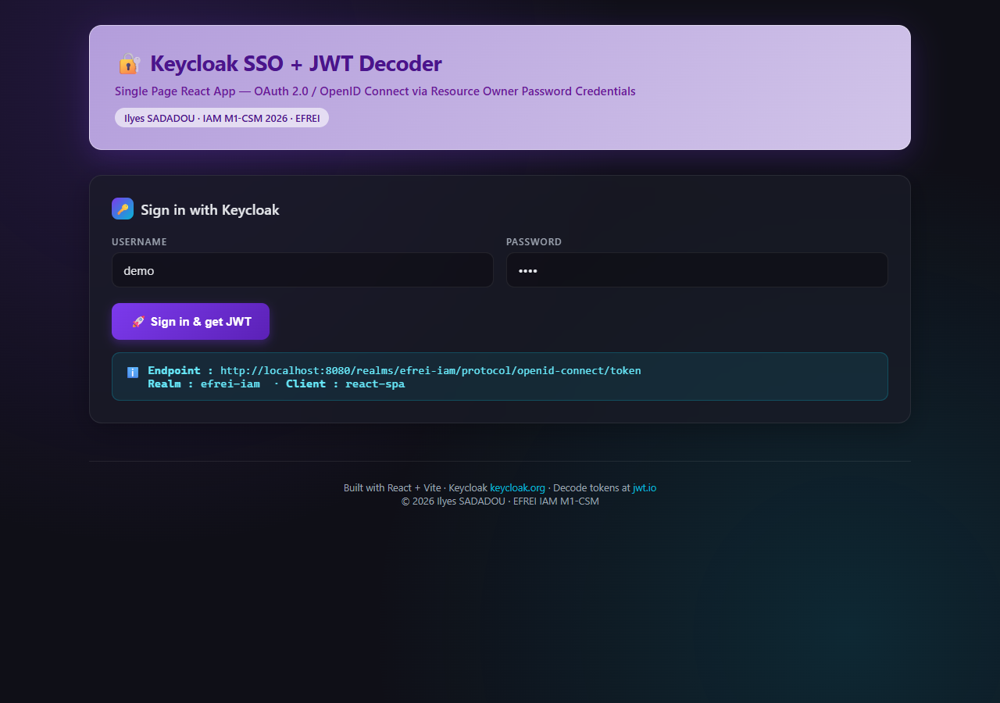

### 📸 Screenshot — Formulaire pré-rempli avec `demo` / `demo`

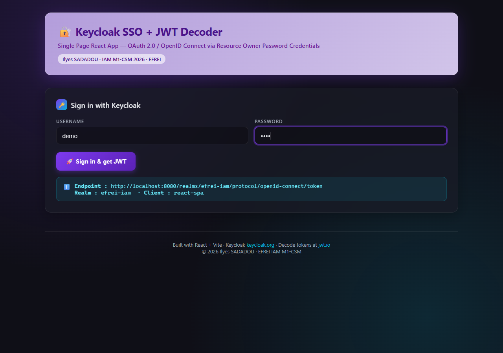

### 📸 Screenshot — Session authentifiée (avatar + boutons + JWT brut)

Le JWT est affiché en couleurs : **header en rouge**, **payload en violet**, **signature en bleu** — exactement comme jwt.io.

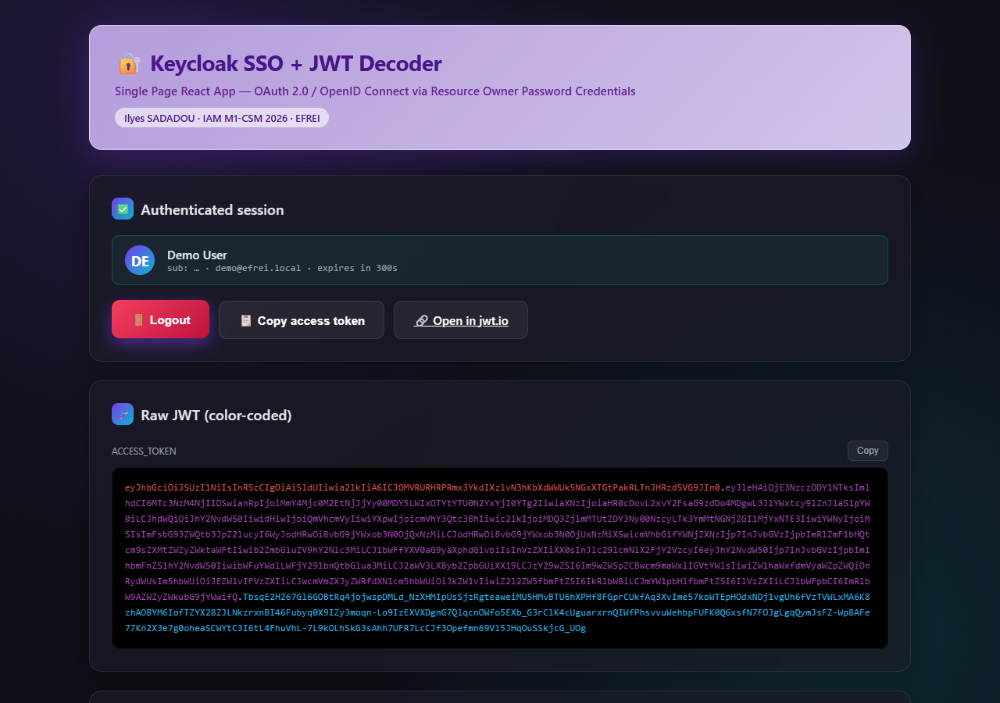

### 📸 Screenshot — Tableau HTML du payload décodé (focus)

Chaque claim a une **description pédagogique**, un **type** (string / number / array / date), et les timestamps `exp` / `iat` / `nbf` sont automatiquement convertis en date ISO + temps relatif (« in 5min », « 0s ago »).

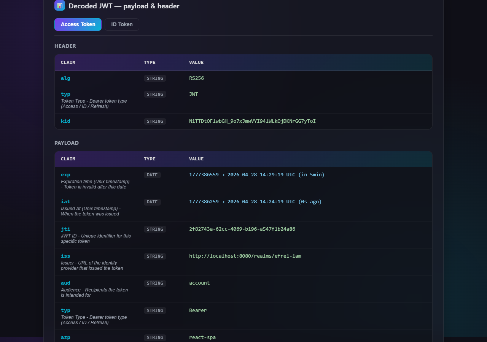

### 📸 Screenshot — Bas du tableau payload (rôles / scopes)

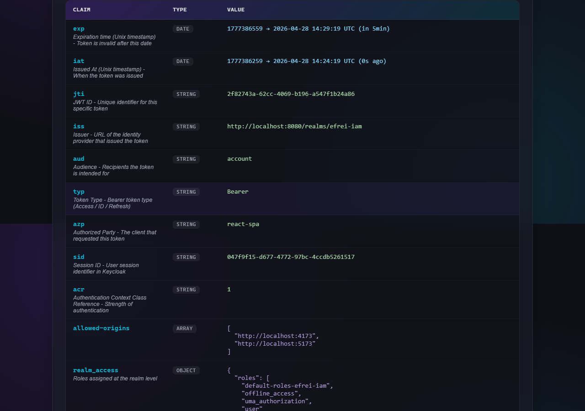

### 📸 Screenshot — Vue *full-page* de la SPA après login

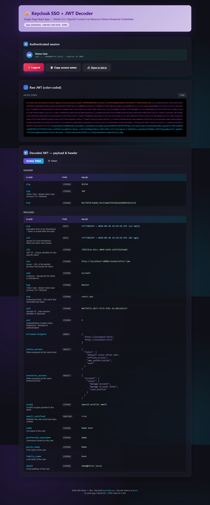

### 📸 Screenshot — Sessions actives dans Keycloak (côté admin)

Après login dans la SPA, on retrouve la session active du user `demo` dans la console Keycloak.

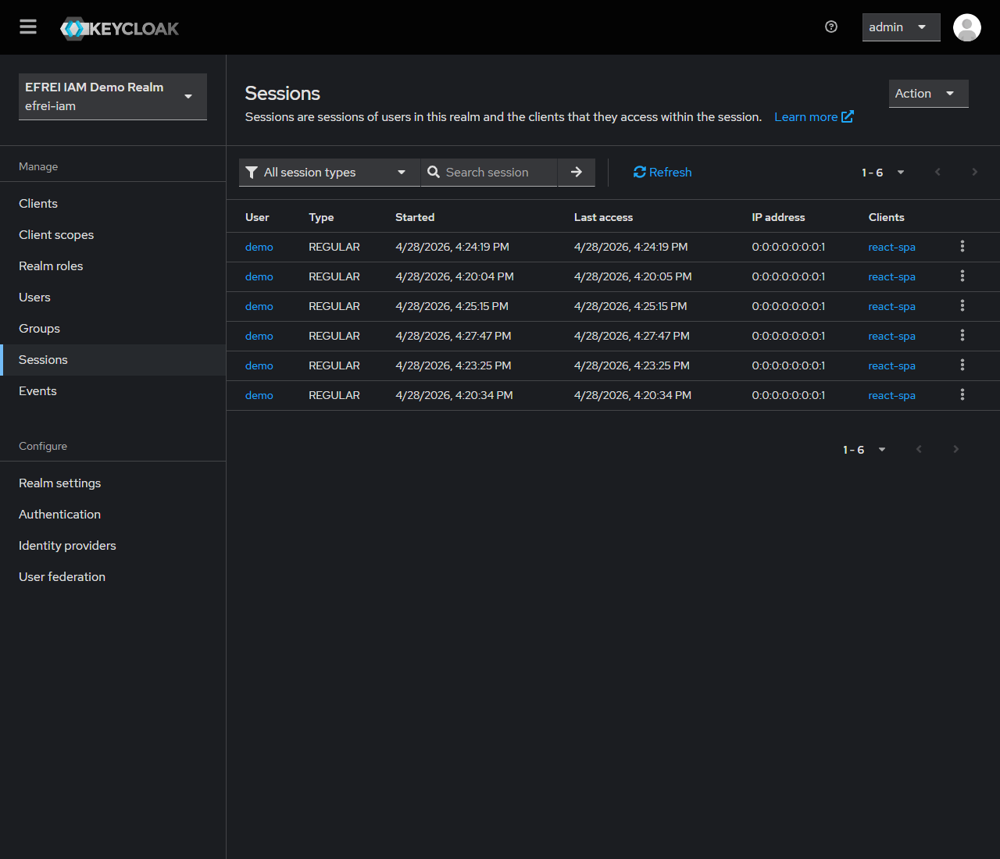

---

## Lancement complet de la démonstration

```powershell
# 1) Keycloak
cd C:\Users\ilyes\Efrei
$env:KC_BOOTSTRAP_ADMIN_USERNAME = 'admin'
$env:KC_BOOTSTRAP_ADMIN_PASSWORD = 'admin'
.\keycloak\keycloak-26.0.1\bin\kc.bat start-dev --import-realm --http-port=8080
# (laisser ce terminal ouvert)

# 2) SPA (autre terminal)
cd C:\Users\ilyes\Efrei\keycloak-jwt-spa
npm install
npm run dev
# Ouvrir http://localhost:5173/  →  login demo/demo
```

| URL                                    | Quoi ?                          |
|----------------------------------------|---------------------------------|
| http://localhost:5173/                 | SPA React                       |
| http://localhost:8080/                 | Keycloak (page d'accueil)       |
| http://localhost:8080/admin/           | Console admin (admin/admin)     |
| http://localhost:8080/realms/efrei-iam/.well-known/openid-configuration | Discovery OIDC |

---

## Sécurité — limites et bonnes pratiques

| Choix de la démo (slide)              | Limite                                                                    | Recommandé en prod                                                            |
|----------------------------------------|---------------------------------------------------------------------------|--------------------------------------------------------------------------------|
| `grant_type=password` (ROPC)           | Le mot de passe transite par la SPA → tout le code JS le voit             | **Authorization Code + PKCE** (redirection vers Keycloak, jamais le mdp côté SPA) |
| `start-dev` (HTTP)                     | Pas de TLS — les tokens passent en clair                                  | `start` + reverse proxy nginx/Traefik avec certificat Let's Encrypt           |
| Admin = `admin` / `admin`              | Mot de passe trivial                                                      | Mot de passe fort + 2FA + IP allowlist sur `/admin/`                          |
| Token stocké en `sessionStorage`       | XSS = compromission du token                                              | Cookies `HttpOnly` + `SameSite=Strict` + CSP stricte                          |
| Pas de vérification de signature côté SPA | Inutile : tout le monde peut récupérer la clé publique                  | Toujours valider la signature côté **API** (server-side)                      |
| Token affiché à l'écran                | OK pour cours/démo                                                        | Jamais en prod                                                                |
| Bruteforce protection : ON dans le realm | OK                                                                       | + rate limiting au niveau du reverse proxy                                    |

---

## Annexes — fichiers livrés

| Fichier                              | Rôle                                                                  |
|--------------------------------------|-----------------------------------------------------------------------|
| `keycloak-jwt-spa/`                  | Projet React Vite (SPA + scripts)                                     |
| `└─ src/App.jsx`                     | Composant principal : formulaire + tableau JWT                        |
| `└─ src/jwt.js`                      | Décodeur JWT (Base64URL → JSON) sans dépendance                       |
| `└─ src/config.js`                   | Endpoints + descriptions des claims                                   |
| `└─ keycloak-realm-export.json`      | Realm + client + users prêts à importer                               |
| `└─ start-keycloak.ps1`              | Bootstrap Docker (méthode 1)                                          |
| `└─ get-token.ps1`                   | Reproduit exactement la cURL de la slide 397                          |
| `└─ docs/DOCUMENTATION.md`           | **Ce document**                                                       |
| `└─ docs/screenshots/*.png`          | Captures de chaque étape                                              |

### Vérification rapide après extraction du ZIP

```powershell
cd "SADADOU Ilyes – IAM M1-CSM 2026 – 28-04-2026\keycloak-jwt-spa"
npm install
npm run build      # doit produire dist/ sans erreur
npm run dev        # http://localhost:5173/
```

---

© 2026 — Ilyes SADADOU — IAM M1-CSM — EFREI Paris
